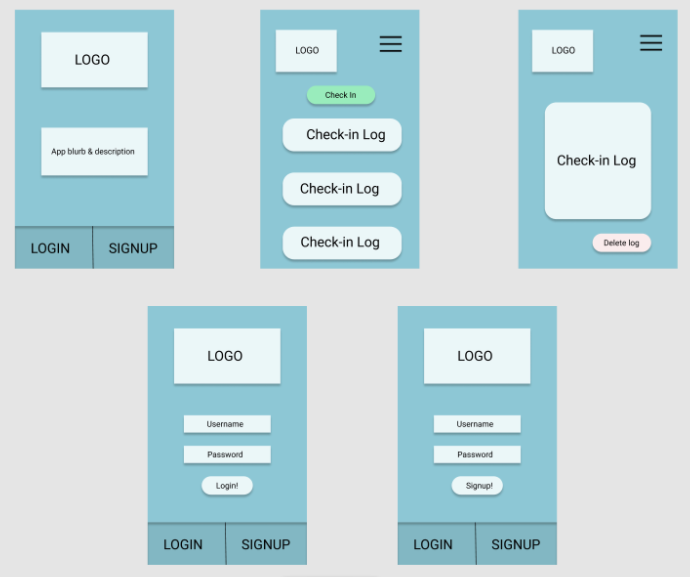

# Safe-Exchange-API
### Getting started

| Express.js | node |
| ----------- | ----------- |
| MongoDB | mongoose |
| Heroku | GitHub |
- **create a new node project** `npm init -y`
- **install dependencies** `npm install dotenv mongoose express cors morgan`
- **install dev dependencies** `npm install --save-dev nodemon`

- API CALL in backend  https://safe-exchange-api.herokuapp.com/
-------------------

	
    
        
Frontend GitHub

https://github.com/CamSkiTheDev/safe-exchange.git
  
Front End Live page
https://practical-ardinghelli-eaf989.netlify.app/


## User Story
The first step to healthy co parenting is to log all  interactions with the other party during child exchanges. This will ensure everyones safety in a court of law. Safe Exchange APP allows the Authenticated user to log the location and video recording on a list of check in points. 


```
A user experience 
```
- Authenticated and Autherized 
- Lands in Logging page 
- Click individual logs to add video and delete logs. Authentic user cannot delete. 


## Wire Frames
